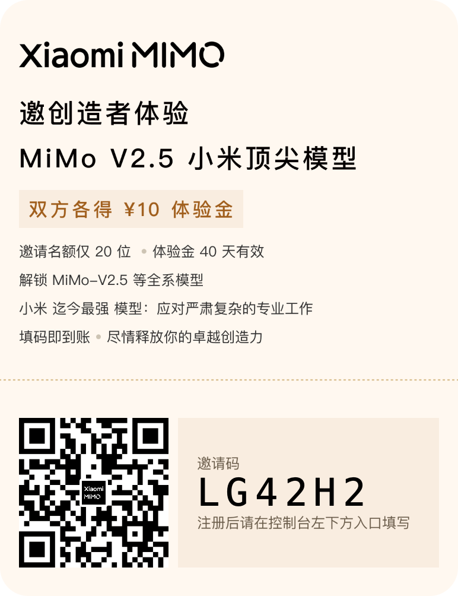

# xiaomimimo · 小米 MiMo 原生 AI Agent 客户端

> **Rust 原生 · 1M 上下文 · TUI + GUI 双端 · 小米 MiMo API 深度适配**

**xiaomimimo** 是专为 [Xiaomi MiMo](https://api.xiaomimimo.com/v1) 深度优化的 Rust 原生 AI Agent 客户端。支持 TUI（终端）和 GUI（桌面）双模式，融合 Claude Desktop 式 Artifacts、MCP 扩展、TTS 语音交互、1M 上下文缓存优化和项目工作区能力。

[中文 README](README.zh-CN.md)

---

## 🎉 100 万亿 Token 免费发放计划

**小米 MiMo** 面向全球用户进行免费 Token 发放，**30 天内发放总计 100 万亿（100T）Token 权益**，赠完即止。

- **活动时间**：北京时间 2026 年 4 月 28 日 00:00 至 5 月 28 日 00:00
- **参与方式**：申请制，通过 [100t.xiaomimimo.com](https://100t.xiaomimimo.com) 填写申请
- **最高权益**：Max 档位 Token Plan，含 **16 亿 Credits**（价值人民币 659 元）

> 💡 拿到 Token Plan 密钥（`tp-` 开头）后，直接设置环境变量即可使用：
> ```bash
> export XIAOMI_API_KEY="tp-xxxxxxxx"
> xiaomimimo
> ```
> **系统自动识别 `tp-` 前缀并路由到 Token Plan 端点，无需手动配置 base URL。**

[English README](README.md)

---

## ✨ 特性

- 🦀 **Rust 原生** — 零运行时依赖，单二进制发布，Windows / macOS / Linux 全平台
- 🖥️ **TUI + GUI 双端** — 终端模式（开发者）+ Tauri 2 桌面模式（Claude Desktop 式体验）
- 🧠 **1M 上下文** — 适配 MiMo-V2.5-Pro 的 1,048,576 token 上下文窗口
- 💬 **Reasoning 流式显示** — 实时展示 MiMo 推理过程，支持折叠/展开
- 📊 **Context Meter** — 实时显示 token 用量、缓存命中率、cost 估算
- 🎨 **Artifacts 系统** — Claude Desktop 式右侧面板，支持 Markdown/代码/HTML/SVG/JSON
- 🔌 **MCP 扩展** — 接入本地文件、Git、浏览器、数据库等 MCP 工具
- 🎤 **TTS 语音** — 适配 MiMo-V2.5-TTS，支持 6 种语音风格、流式播报
- 🔐 **安全审批** — 文件写入/Shell/Git 操作可配置审批策略，YOLO 模式默认关闭
- 📦 **项目工作区** — 文件树、Git Diff、Terminal、Patch Preview
- 🗄️ **Session 持久化** — SQLite 存储会话历史，支持恢复、Fork、归档
- 🔑 **Keychain 集成** — API key 存入系统钥匙链，不写明文

---

## 📥 安装

```bash
# Cargo（推荐 — 无需 Node）
cargo install --git https://github.com/Hmbown/xiaomimimo-tui xiaomimimo-tui-cli xiaomimimo-tui

# 从源码构建
git clone https://github.com/Hmbown/xiaomimimo-tui
cd xiaomimimo-tui
cargo build --release
# 二进制: ./target/release/xiaomimimo

# GUI（需要 Node.js 18+）
cd apps/xiaomimimo-gui
pnpm install
pnpm tauri dev
```

---

## 🚀 快速开始

```bash
# 1. 设置 API key（两种任选）
export XIAOMI_API_KEY="tp-xxxxxxxx"   # Token Plan（免费）
export XIAOMI_API_KEY="sk-xxxxxxxx"   # 订阅 API

# 2a. TUI 交互模式
xiaomimimo

# 2b. 单次提问
xiaomimimo -p "用 Rust 写一个 HTTP server"

# 2c. GUI 桌面模式
cd apps/xiaomimimo-gui && pnpm tauri dev

# 3. 指定模型
xiaomimimo --model mimo-v2.5-pro -p "解释量子计算"
```

**三种 Agent 模式**：
- `Plan` — 只读分析，不修改文件
- `Agent` — 请求用户批准后修改
- `YOLO` — 自动执行（保留 snapshot，可回滚）

在 TUI 中用 `/model` 切换，GUI 中用 Settings 面板切换。

---

## 🤖 支持的 MiMo 模型

| 模型 | 上下文 | 特性 |
|------|--------|------|
| `mimo-v2.5-pro` ⭐ | 1,048,576 | 深度推理 · 代码 · 长任务 |
| `mimo-v2.5` | 262,144 | 快速响应 · 日常对话 |
| `mimo-v2-omni` | 262,144 | 多模态 · 图片理解 |
| `mimo-v2.5-tts` | 8,192 | 文本转语音 |

> 设置 `XIAOMI_API_KEY` 后系统自动检测 Xiaomi provider。`tp-` 前缀自动路由到 Token Plan 端点，`sk-` 前缀路由到订阅 API。

---

## 🖥️ TUI 界面

```
┌──────────────────────────────────────────────────────────────┐
│ xiaomimimo · mimo-v2.5-pro    184K/1M 18% ▰▱▱▱  MiMo  live │
├───────────────┬──────────────────────────────────────────────┤
│ Workspace     │ Chat / Agent Stream                          │
│ - files       │ ▸ reasoning                                  │
│ - git diff    │ tool calls                                   │
│ - tasks       │ patch preview                                 │
├───────────────┴──────────────────────────────────────────────┤
│ agent · mimo-v2.5-pro · $0.00 · cache 82%                    │
└──────────────────────────────────────────────────────────────┘
```

Header 实时显示 model、token 用量、cache 命中率、provider 标签。

---

## 🖥️ GUI 界面

GUI 基于 **Tauri 2 + React + TypeScript + Tailwind**，提供 Claude Desktop 式双栏体验：

| 面板 | 功能 |
|------|------|
| Chat | 多轮对话 · Markdown 渲染 · Reasoning 折叠 · Tool Call 卡片 |
| Artifacts | 右侧独立面板 · Code/Markdown/HTML/SVG/JSON 渲染 · 版本管理 |
| Workspace | 文件树 · Git Diff · Terminal · Patch Preview |
| Context | 1M 上下文可视化 · Token 分层 · Cache 状态 · 风险评级 |
| Extensions | MCP Server 管理 · 权限开关 · 连接测试 |
| Voice | TTS 控制 · 6 种语音风格 · Speed 调节 · 音频历史 |
| Settings | Model 选择 · API Key 管理 · 安全策略 · 主题 |

首次启动进入 Onboarding，输入 key 后直接使用，无需配置环境变量。

---

## 🔧 配置

```toml
# ~/.xiaomimimo/config.toml
provider = "xiaomi"

[providers.xiaomi]
api_key = "tp-xxxxxxxx"
model = "mimo-v2.5-pro"
```

更多选项见 [config.example.toml](config.example.toml)。

---

## 📜 开源协议

**MIT License** — 详见 [LICENSE](LICENSE)。

本项目的初始代码基于 [Hmbown/DeepSeek-TUI](https://github.com/Hmbown/DeepSeek-TUI)，在此对原作者和社区表示衷心感谢。

---

## 🙏 致谢

- **小米 MiMo 团队** — 提供 MiMo API 和 100T Token 免费发放计划
- **DeepSeek-TUI 社区** — 提供优秀的 Rust AI Agent TUI 代码基础
- **Tauri 团队** — 提供跨平台桌面应用框架
- **所有贡献者** — 参与测试、反馈和代码贡献

---

<p align="center">
  
</p>

<p align="center">
  <sub>Made with 🦀 Rust · Powered by Xiaomi MiMo</sub>
</p>
